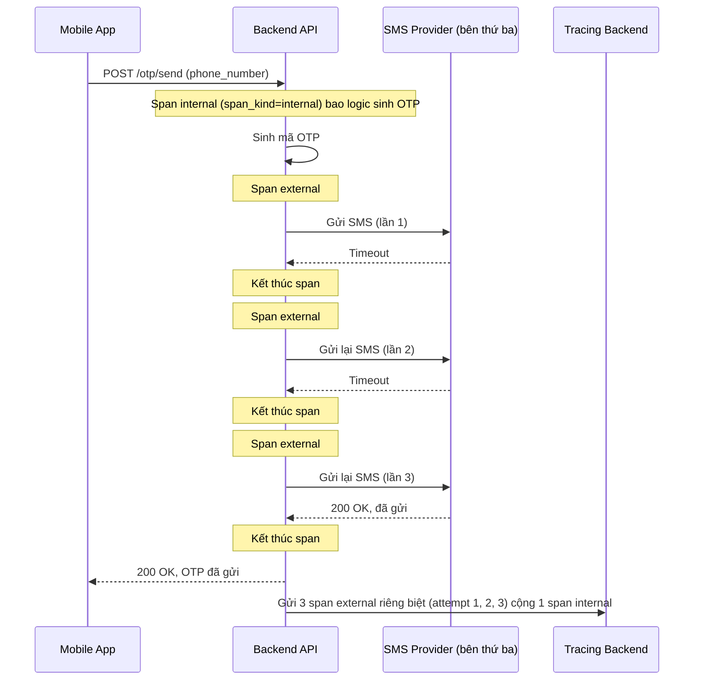

# Sequence - Enhance: Gửi SMS OTP (mỗi lần retry 1 span, không ghi nội dung OTP)

Đây là flow **enhance** của `send-otp-sms` (so với base). Khác biệt so với base: mỗi lần gọi SMS provider (kể cả các lần retry) được bọc trong 1 span external riêng, gắn `attempt_number` tăng dần và `is_retry=true` từ lần thứ 2 trở đi, để phân biệt rõ "1 cuộc gọi chậm" với "3 lần gọi cộng dồn". Tag của span chỉ ghi metadata debug (status, duration, error_code), không ghi số điện thoại hay nội dung mã OTP thật. Đáp ứng **yêu cầu 1, 3 và 5** của đề bài.

