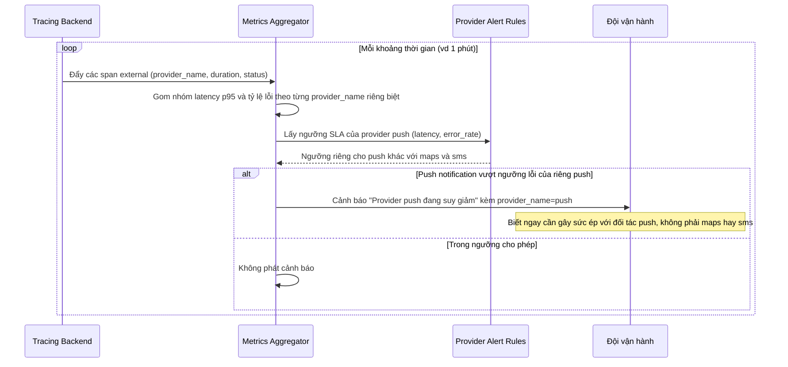

# Sequence - Enhance: Phát hiện suy giảm chất lượng theo từng provider

Đây là flow **enhance hoàn toàn mới**, không tồn tại ở base (base chỉ có 1 cảnh báo chung "API chậm" gộp mọi nguyên nhân). Flow này mô tả hệ thống giám sát tổng hợp các span external theo `provider_name`, so với `PROVIDER_ALERT_RULE` riêng của từng provider (bản đồ, SMS, push notification), để phát hiện đúng provider nào đang suy giảm thay vì báo chung chung. Đáp ứng **yêu cầu 4** của đề bài.

