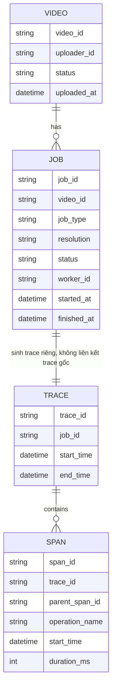

# ERD - Base: Mỗi job xử lý video có trace riêng biệt

Đây là trạng thái **base**, trước khi áp đề bài. Hệ thống đã có pipeline xử lý video bất đồng bộ (kiểm duyệt, transcode nhiều độ phân giải, tạo thumbnail, publish) chạy trên nhiều worker, và mỗi job đã có tracing ở mức cơ bản — nhưng mỗi job tự sinh ra 1 trace riêng của nó, không có khái niệm "trace gốc" gộp toàn bộ pipeline của 1 video lại với nhau. Đây là nền tảng để đề bài (gộp về 1 trace gốc, thể hiện đúng quan hệ song song, tách bạch thời gian backoff, tổng hợp theo bước, xử lý video bị xoá giữa chừng) có ý nghĩa khi so sánh.

Lưu ý: `TRACE` gắn 1-1 với `JOB` chứ không gắn với `VIDEO`, nên không có cách nào truy vấn "toàn bộ tiến trình xử lý của 1 video" trong 1 trace duy nhất, cũng chưa có entity nào tổng hợp số liệu theo từng loại bước (`job_type`) trên toàn hệ thống — đây chính là các khoảng trống mà enhance sẽ lấp.
