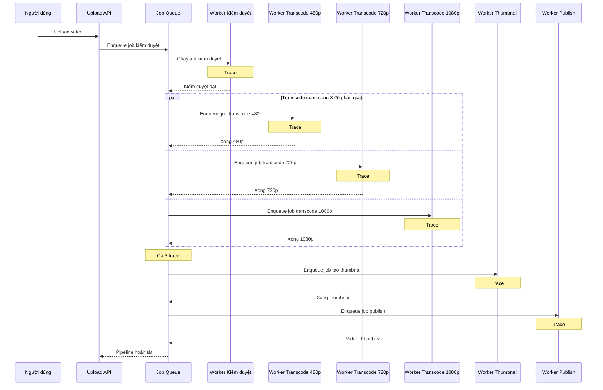

# Sequence - Base: Xử lý pipeline video (mỗi job 1 trace riêng)

Đây là flow **base**: sau khi upload, video đi qua kiểm duyệt, rồi transcode song song 3 độ phân giải, rồi tạo thumbnail và publish. Mỗi job tự sinh trace riêng của nó trên worker mà nó chạy, không có trace gốc chung, nên không thể nhìn thấy quan hệ song song thật giữa 3 job transcode — trên dashboard chúng hiện ra như 3 trace độc lập, không rõ có chạy cùng lúc hay không. Đây là tiền đề cho yêu cầu 1 và 2 của đề bài.

