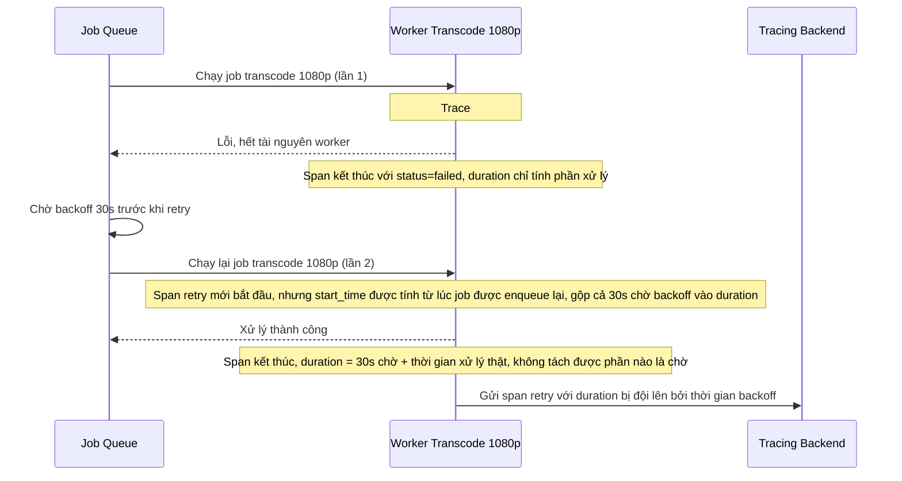

# Sequence - Base: Retry job sau backoff (không tách thời gian chờ)

Đây là flow **base**: job transcode 1080p thất bại do worker hết tài nguyên, hệ thống tự động retry sau một khoảng backoff. Toàn bộ thời gian chờ backoff bị tính gộp luôn vào duration của span retry, khiến "thời gian xử lý trung bình" của bước này bị tính sai lệch (bị đội lên bởi thời gian chờ, không phải thời gian xử lý thật). Đây là tiền đề cho yêu cầu 3 của đề bài.

