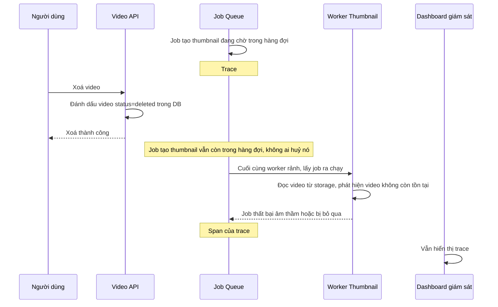

# Sequence - Base: Xoá video giữa lúc đang xử lý (trace treo mãi mãi)

Đây là flow **base**: người dùng xoá video trong lúc job thumbnail vẫn đang nằm trong hàng đợi chờ worker rảnh. Job này (và trace của nó) không được ai chủ động đóng lại, nên trên dashboard giám sát nó hiển thị mãi ở trạng thái "đang xử lý" dù thực tế video đã bị xoá và sẽ không bao giờ hoàn tất. Đây là tiền đề cho yêu cầu 5 của đề bài.

