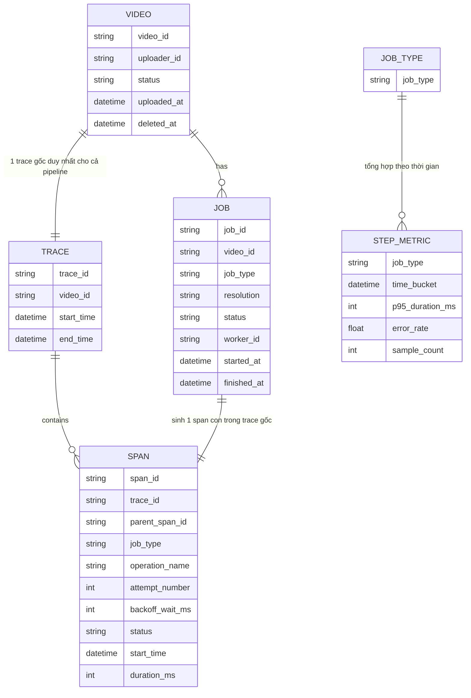

# ERD - Enhance: Trace gốc theo video, span song song, backoff tách riêng, tổng hợp theo bước

Đây là trạng thái **enhance**, sau khi áp toàn bộ đề bài lên base. So với base, các thay đổi chính:

- `TRACE` chuyển từ gắn 1-1 với `JOB` sang gắn 1-1 với `VIDEO` — mọi job của cùng 1 video (kể cả chạy trên worker pool khác nhau) đều sinh span dưới cùng 1 `trace_id` — đáp ứng **yêu cầu 1**.
- `SPAN` có thêm `parent_span_id` dùng nhất quán để 3 span transcode song song đều là con trực tiếp của cùng 1 span cha (bước "transcode"), thể hiện đúng quan hệ sibling thay vì bị xếp tuần tự — đáp ứng **yêu cầu 2**.
- `SPAN` có thêm `attempt_number`, `backoff_wait_ms` (tách riêng khỏi `duration_ms` là thời gian xử lý thật) — đáp ứng **yêu cầu 3**.
- Thêm entity `STEP_METRIC` tổng hợp theo `job_type` trên toàn hệ thống (không theo từng video) để trả lời câu hỏi "bước nào đang chậm dần" — đáp ứng **yêu cầu 4**.
- `SPAN.status` có thêm giá trị `cancelled`, và `VIDEO` có thêm `deleted_at` — khi video bị xoá, mọi job/span chưa hoàn tất của video đó được đóng lại với status `cancelled` thay vì treo mãi — đáp ứng **yêu cầu 5**.

