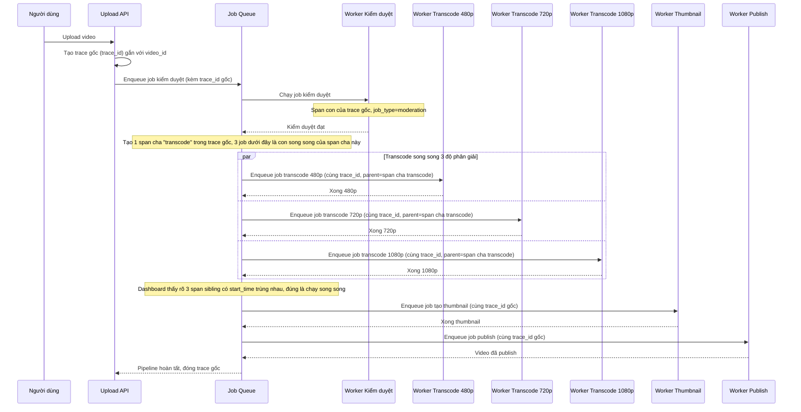

# Sequence - Enhance: Xử lý pipeline video (1 trace gốc, span song song đúng thực tế)

Đây là flow **enhance** của `pipeline-processing` (so với base). Khác biệt so với base: toàn bộ job của video (kiểm duyệt, 3 job transcode, thumbnail, publish) đều sinh span dưới cùng 1 `trace_id` gốc gắn với video, và 3 span transcode song song đều là con trực tiếp của 1 span cha "transcode", nên trace thể hiện đúng chúng chạy song song thay vì bị hiểu lầm là tuần tự. Đáp ứng **yêu cầu 1 và 2** của đề bài.

