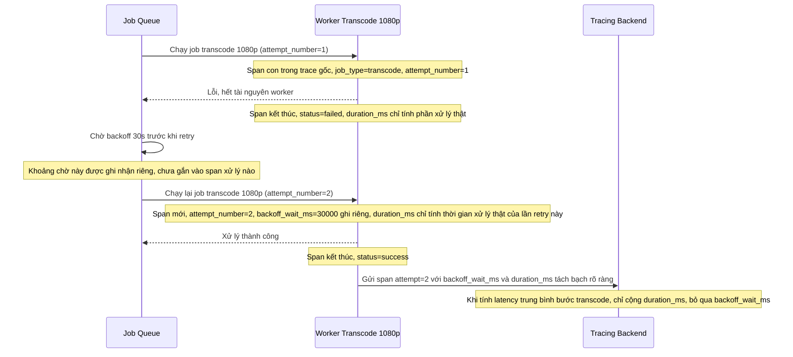

# Sequence - Enhance: Retry job sau backoff (tách riêng thời gian chờ)

Đây là flow **enhance** của `job-retry-backoff` (so với base). Khác biệt so với base: span retry ghi rõ `attempt_number=2` và có field `backoff_wait_ms` riêng biệt lưu thời gian cố ý delay, tách hoàn toàn khỏi `duration_ms` là thời gian xử lý thật, để số liệu "thời gian xử lý trung bình" của bước transcode 1080p không bị tính sai bởi thời gian chờ backoff. Đáp ứng **yêu cầu 3** của đề bài.

