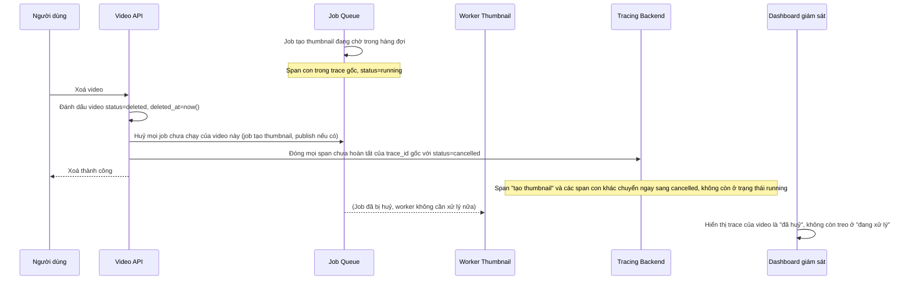

# Sequence - Enhance: Xoá video giữa lúc đang xử lý (đóng span với trạng thái cancelled)

Đây là flow **enhance** của `video-delete-during-processing` (so với base). Khác biệt so với base: khi video bị xoá, API chủ động tìm mọi span chưa hoàn tất thuộc `trace_id` gốc của video đó (bao gồm cả job còn đang nằm trong hàng đợi) và đóng lại rõ ràng với `status=cancelled`, thay vì để trace treo mãi ở trạng thái "đang xử lý". Đáp ứng **yêu cầu 5** của đề bài.

