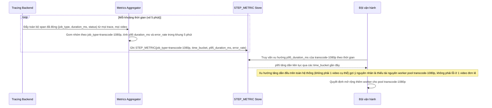

# Sequence - Enhance: Tổng hợp latency theo từng bước trên toàn hệ thống

Đây là flow **enhance hoàn toàn mới**, không tồn tại ở base (base chỉ có trace riêng lẻ theo từng job/video, không có tầng tổng hợp theo bước trên toàn hệ thống). Flow này mô tả hệ thống gom span theo `job_type` (vd transcode 1080p) từ mọi video, mọi trace, để trả lời câu hỏi "bước transcode 1080p có đang chậm dần theo thời gian do thiếu tài nguyên worker hay không". Đáp ứng **yêu cầu 4** của đề bài.

