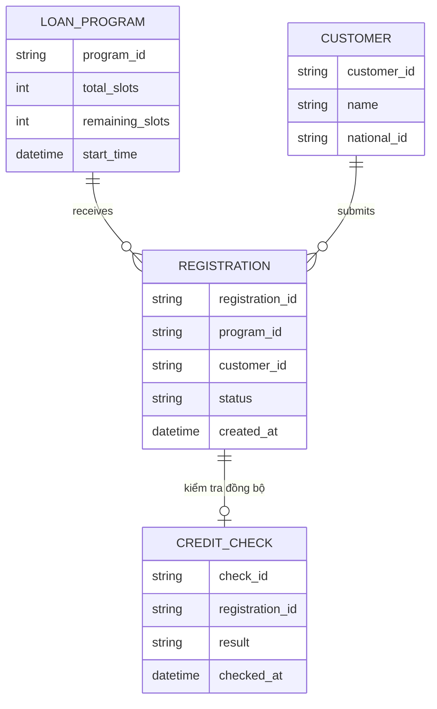

# ERD - Base: Đăng ký vay ưu đãi với suất còn lại đọc-rồi-ghi

Đây là trạng thái **base**, trước khi áp đề bài. App ngân hàng số đã có chương trình vay ưu đãi giới hạn số suất, khách hàng bấm đăng ký, backend kiểm tra `remaining_slots` rồi trừ đi 1 (đọc-rồi-ghi, không atomic), sau đó gọi kiểm tra tín dụng đồng bộ (block chờ vài giây). Không có khái niệm "vị trí hàng đợi" tách biệt khỏi việc cấp suất, nên suất bị trừ ngay tại thời điểm bấm đăng ký chứ không phải sau khi qua được kiểm tra tín dụng. Đây là nền tảng để đề bài (giữ vị trí atomic, nhả suất cho người kế tiếp, atomic counter, retry/timeout, dashboard real-time) có ý nghĩa khi so sánh.

Lưu ý: `LOAN_PROGRAM.remaining_slots` được cập nhật bằng đọc giá trị hiện tại rồi ghi giá trị mới (không atomic), `REGISTRATION` không có field vị trí hàng đợi (`queue_position`) tách biệt, và `CREDIT_CHECK` chỉ có 1 lần kiểm tra duy nhất, không có `attempt_number` hay cơ chế timeout/retry — đây chính là các khoảng trống mà enhance sẽ lấp.
