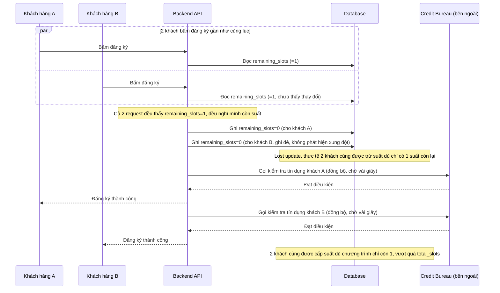

# Sequence - Base: Đăng ký vay ưu đãi (trừ suất đọc-rồi-ghi, chặn đồng bộ)

Đây là flow **base**: khách hàng bấm đăng ký, backend đọc `remaining_slots`, kiểm tra còn suất thì trừ đi 1 rồi mới gọi kiểm tra tín dụng, toàn bộ request bị block chờ credit bureau trả kết quả (vài giây) trước khi phản hồi khách hàng. Vì đọc-rồi-ghi không atomic, khi nhiều khách bấm cùng lúc có thể xảy ra lost update (2 khách cùng đọc `remaining_slots=1`, cùng trừ xuống 0, cả 2 đều được xác nhận dù chỉ còn đúng 1 suất). Đây là tiền đề cho yêu cầu 1 và 3 của đề bài.

