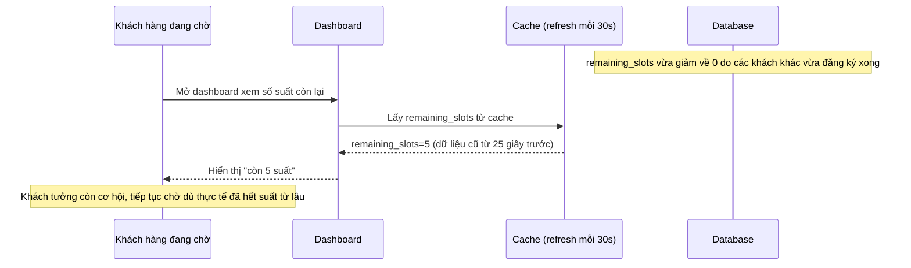

# Sequence - Base: Xem số suất còn lại (đọc từ cache trễ)

Đây là flow **base**: khách hàng đang chờ xem dashboard hiển thị số suất còn lại, nhưng dashboard đọc từ 1 lớp cache được refresh định kỳ (vd mỗi 30 giây), không đồng bộ ngay với trạng thái thật trong DB. Khách có thể thấy "còn 5 suất" trong khi thực tế đã hết, hoặc ngược lại. Đây là tiền đề cho yêu cầu 5 của đề bài.

