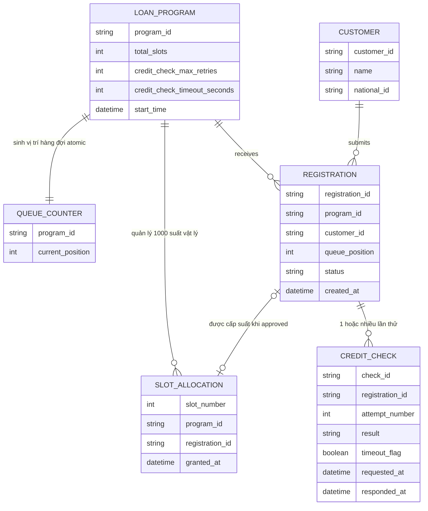

# ERD - Enhance: Vị trí hàng đợi atomic, nhả suất tuần tự, retry/timeout, dashboard real-time

Đây là trạng thái **enhance**, sau khi áp toàn bộ đề bài lên base. So với base, các thay đổi chính:

- Thêm `QUEUE_COUNTER` — bộ đếm atomic increment riêng (DB `SELECT ... FOR UPDATE`/`INCR` hoặc cache atomic), sinh `queue_position` ngay khi khách bấm đăng ký, tách biệt hoàn toàn khỏi việc cấp suất — đáp ứng **yêu cầu 1 và 3**.
- `REGISTRATION` có thêm `queue_position` (gán atomic tại thời điểm đăng ký) và `status` mở rộng (`queued`, `checking_credit`, `approved`, `rejected`, `slot_granted`, `slot_released`, `expired`) thay vì chỉ 1 lần trừ suất tức thời — đáp ứng **yêu cầu 1 và 2**.
- Thêm entity `SLOT_ALLOCATION` đại diện cho 1000 suất vật lý, mỗi suất chỉ gắn với đúng 1 `registration_id` tại một thời điểm, việc "nhả suất - cấp cho người kế tiếp" là 1 transaction atomic trên chính entity này — đáp ứng **yêu cầu 2**.
- `CREDIT_CHECK` có thêm `attempt_number`, `requested_at`, `responded_at`, `timeout_flag`, và `LOAN_PROGRAM` có thêm `credit_check_max_retries`, `credit_check_timeout_seconds` — đáp ứng **yêu cầu 4**.
- Bỏ lớp cache trễ cho số suất còn lại: `remaining_slots` được suy ra trực tiếp từ đếm `SLOT_ALLOCATION` đang active, phát real-time qua event tới dashboard — đáp ứng **yêu cầu 5**.

