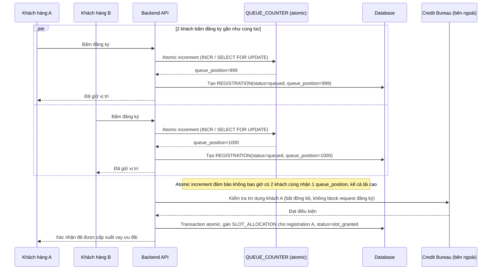

# Sequence - Enhance: Đăng ký vay ưu đãi (giữ vị trí atomic, xác nhận suất bất đồng bộ)

Đây là flow **enhance** của `register-for-loan-offer` (so với base). Khác biệt so với base: đăng ký tách thành 2 bước rõ ràng — (1) giữ vị trí hàng đợi bằng atomic increment ngay khi bấm, không liên quan gì tới việc trừ suất, (2) chỉ sau khi qua kiểm tra tín dụng mới atomic gán 1 trong 1000 `SLOT_ALLOCATION` cho khách. Vì bước 1 dùng atomic increment ở DB/cache, 2 khách bấm cùng lúc luôn nhận được 2 `queue_position` khác nhau, không còn lost update. Đáp ứng **yêu cầu 1 và 3** của đề bài.

