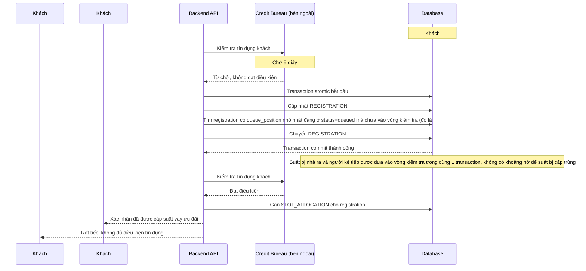

# Sequence - Enhance: Từ chối tín dụng, nhả suất atomic cho người kế tiếp

Đây là flow **enhance hoàn toàn mới**, minh hoạ đúng kịch bản nêu trong đề bài: khách #999 và #1000 giữ được vị trí hợp lệ, nhưng khách #999 bị từ chối tín dụng sau 5 giây — suất phải được chuyển đúng cho khách #1001 (người kế tiếp trong hàng đợi, không phải #1000 vì #1000 đã có vị trí riêng của mình và đang tự chờ kết quả credit check của chính mình), toàn bộ việc "nhả suất - cấp suất kế tiếp" atomic trong 1 transaction để không có 2 khách cùng được cấp 1 suất. Đáp ứng **yêu cầu 2** của đề bài.

