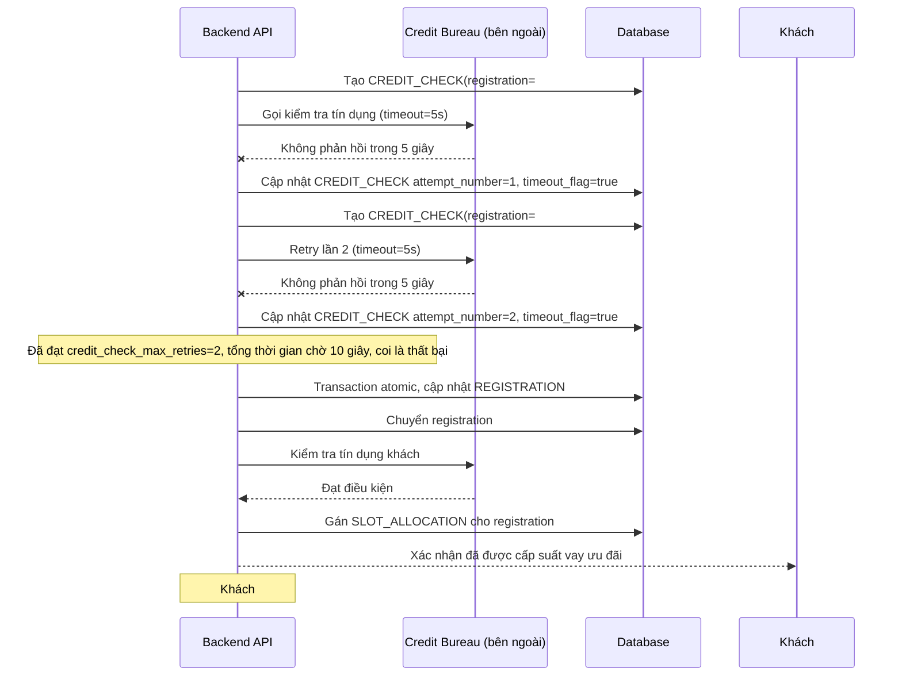

# Sequence - Enhance: Credit bureau timeout, retry giới hạn rồi nhả suất

Đây là flow **enhance hoàn toàn mới**, mô tả trường hợp credit bureau (hệ thống bên ngoài) không phản hồi đúng hạn. Quy định: tối đa 2 lần retry, mỗi lần chờ tối đa 5 giây (tổng thời gian chờ tối đa cho 1 khách là 15 giây), quá số lần này coi là thất bại và nhả suất cho người kế tiếp ngay, không để khách bị timeout chặn vô thời hạn cả hàng đợi phía sau. Đáp ứng **yêu cầu 4** của đề bài.

