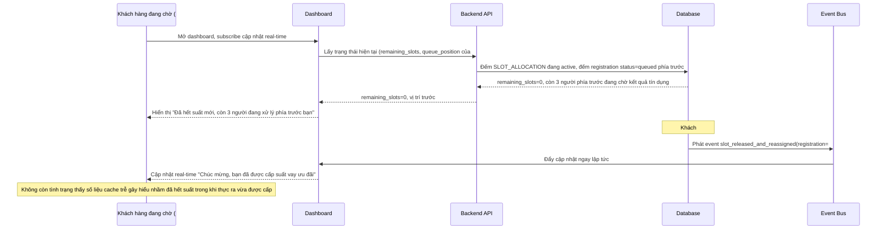

# Sequence - Enhance: Xem số suất còn lại và vị trí hàng đợi real-time

Đây là flow **enhance** của `view-remaining-slots-dashboard` (so với base). Khác biệt so với base: dashboard không còn đọc từ cache refresh định kỳ, mà nhận cập nhật qua event (đăng ký mới, nhả suất, cấp suất) được phát ngay khi trạng thái trong DB thay đổi, đồng thời khách hàng đang chờ có thể xem đúng vị trí hàng đợi của mình so với suất đã cấp xong. Đáp ứng **yêu cầu 5** của đề bài.

