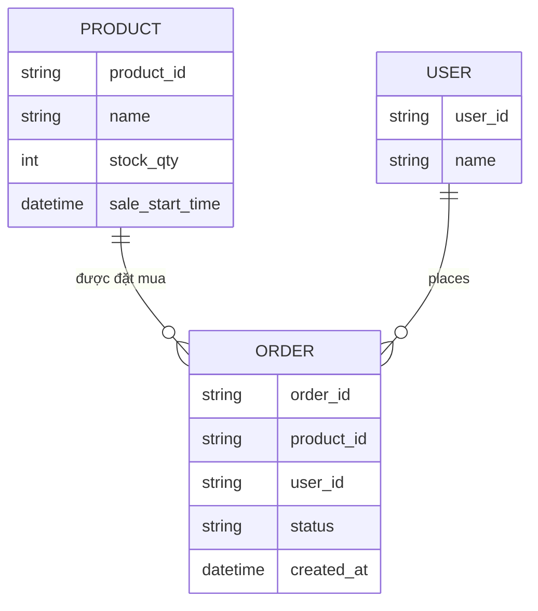

# ERD - Base: Checkout kiểm tra tồn kho kiểu đọc-rồi-ghi

Đây là trạng thái **base**, trước khi áp đề bài. Sàn e-commerce đã có sản phẩm với số lượng tồn kho, khách bấm "Mua ngay" thì backend đọc `stock_qty`, kiểm tra `> 0` ở tầng application rồi mới `UPDATE` trừ đi 1 — đây chính là pattern race-condition kinh điển mà đề bài yêu cầu loại bỏ. Không có hàng đợi/rate-limiter trước DB, không có idempotency key, không có circuit breaker khi hết hàng. Đây là nền tảng để đề bài (atomic update, queue/rate-limiter, idempotency, circuit breaker) có ý nghĩa khi so sánh.

Lưu ý: không có field `idempotency_key` trên `ORDER`, không có entity nào đại diện cho hàng đợi/rate-limiter trước khi chạm DB, và không có trạng thái circuit breaker khi `stock_qty` về 0 — đây chính là các khoảng trống mà enhance sẽ lấp.
