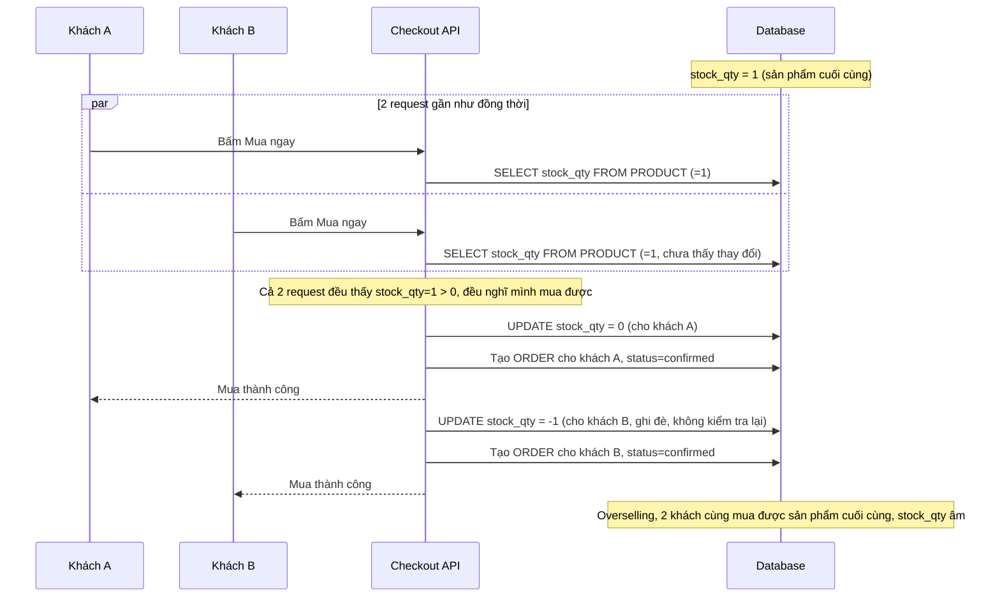

# Sequence - Base: Mua ngay (đọc tồn kho rồi trừ, race condition)

Đây là flow **base**: hàng chục nghìn request cùng "Mua ngay" đổ thẳng xuống DB, mỗi request đọc `stock_qty`, kiểm tra `> 0` ở tầng application rồi mới `UPDATE` trừ đi 1. Khi tồn kho còn đúng 1 sản phẩm, 2 request đến gần như đồng thời đều đọc thấy `stock_qty=1 > 0`, cả 2 đều được xác nhận mua, dẫn tới overselling. Đây là tiền đề cho yêu cầu 1, 2 và 3 của đề bài.

