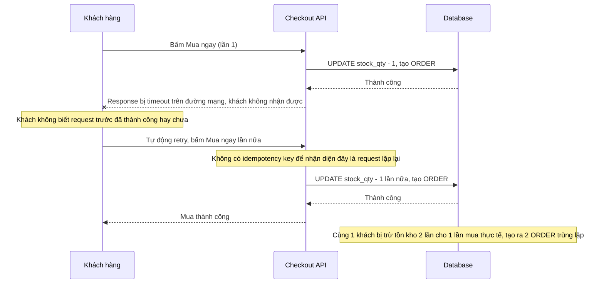

# Sequence - Base: Retry sau timeout mạng (trừ tồn kho lần 2)

Đây là flow **base**: client bấm "Mua ngay", mạng chập chờn khiến response bị timeout dù request đã xử lý thành công ở backend, client không biết nên tự động retry với cùng thao tác. Vì không có idempotency key, backend coi request retry là 1 giao dịch mới hoàn toàn và trừ tồn kho lần nữa cho cùng 1 khách. Đây là tiền đề cho yêu cầu 4 của đề bài.

