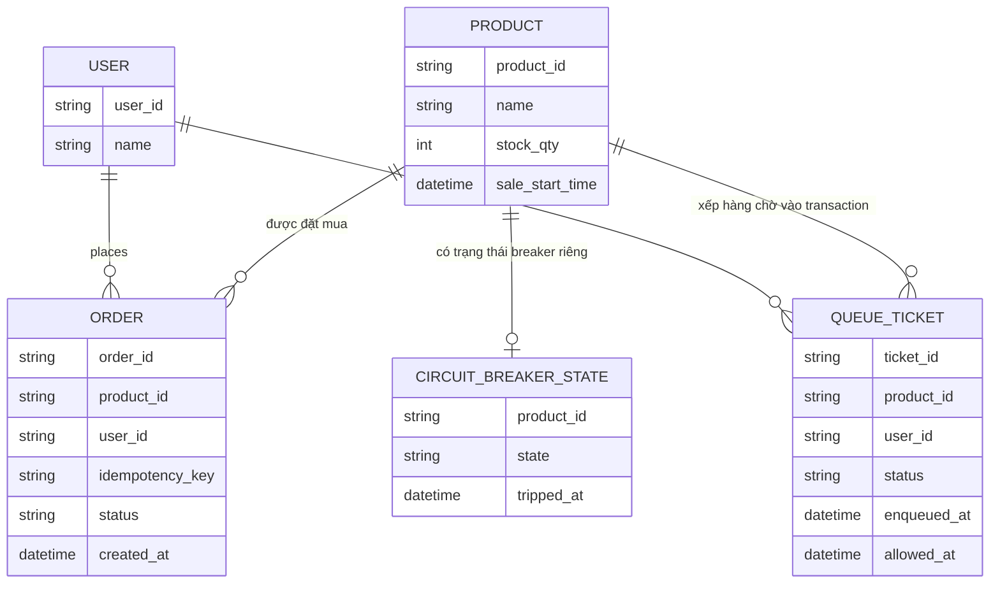

# ERD - Enhance: Atomic update, hàng đợi trước DB, idempotency key, circuit breaker

Đây là trạng thái **enhance**, sau khi áp toàn bộ đề bài lên base. So với base, các thay đổi chính:

- Bỏ hoàn toàn pattern đọc-rồi-ghi: `PRODUCT.stock_qty` chỉ được trừ bằng `UPDATE ... SET qty = qty - 1 WHERE qty > 0`, dựa vào affected rows để biết có mua được hay không — đáp ứng **yêu cầu 1 và 3**.
- Thêm entity `QUEUE_TICKET` — mọi request phải qua hàng đợi/rate-limiter trước khi được phép chạm vào transaction trừ tồn kho, request vượt hạn mức nhận trạng thái `waiting` thay vì đấm thẳng vào DB — đáp ứng **yêu cầu 2**.
- `ORDER` có thêm `idempotency_key` (unique theo `user_id` + key), cho phép trả lại đúng kết quả của lần xử lý đầu khi client retry — đáp ứng **yêu cầu 4**.
- Thêm entity `CIRCUIT_BREAKER_STATE` theo từng `product_id` — khi `stock_qty` về 0, breaker chuyển `open`, chặn request ngay ở tầng cache/gateway, không cho lọt xuống DB — đáp ứng **yêu cầu 5**.

