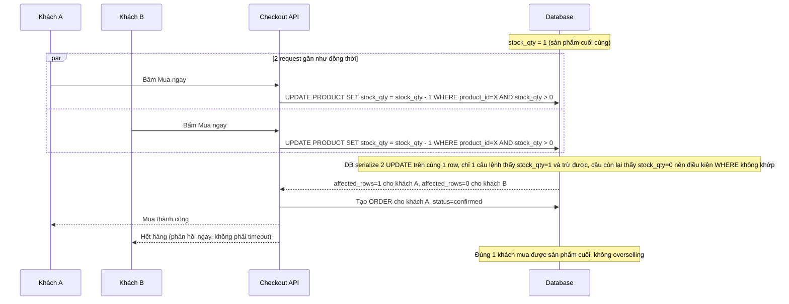

# Sequence - Enhance: Mua ngay (atomic update, kiểm tra affected rows)

Đây là flow **enhance** của `buy-now-checkout` (so với base). Khác biệt so với base: không còn bước `SELECT` riêng để kiểm tra tồn kho, thay vào đó chạy thẳng `UPDATE stock_qty = stock_qty - 1 WHERE stock_qty > 0` và kiểm tra số dòng bị ảnh hưởng (affected rows) để biết có mua được hay không — DB tự đảm bảo tính atomic ở mức row-lock, nên khi tồn kho còn đúng 1, trong 2 request đến gần như đồng thời chỉ đúng 1 request có `affected_rows=1`. Đáp ứng **yêu cầu 1 và 3** của đề bài.

