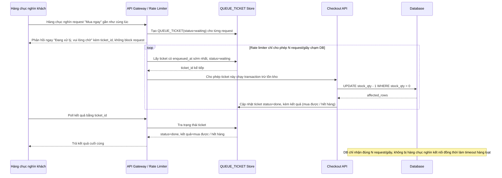

# Sequence - Enhance: Hàng đợi/rate-limiter chặn trước khi chạm DB

Đây là flow **enhance hoàn toàn mới**, mô tả lớp hàng đợi/rate-limiter đặt trước transaction trừ tồn kho. Khi hàng chục nghìn request cùng đổ vào lúc 12:00:00, chỉ 1 số lượng giới hạn/giây được cho phép chạm vào DB, các request còn lại nhận ngay phản hồi "đang xử lý, vui lòng chờ" thay vì để tất cả cùng đấm vào DB gây timeout hàng loạt. Đáp ứng **yêu cầu 2** của đề bài.

