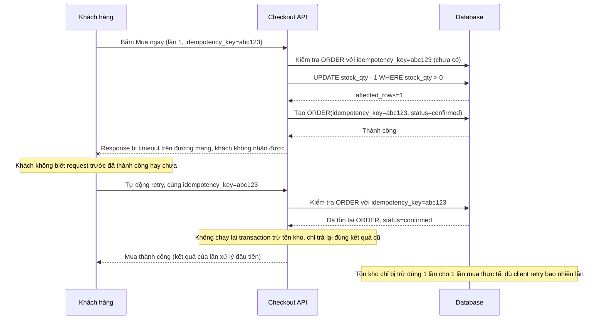

# Sequence - Enhance: Retry sau timeout mạng (idempotent, không trừ tồn kho lần 2)

Đây là flow **enhance** của `retry-after-timeout` (so với base). Khác biệt so với base: client gửi kèm `idempotency_key` cố định cho lần bấm mua đó (kể cả khi retry), backend kiểm tra key này đã tồn tại `ORDER` hay chưa trước khi chạy transaction trừ tồn kho — nếu đã tồn tại, trả thẳng lại kết quả của lần xử lý đầu tiên, không chạy lại transaction. Đáp ứng **yêu cầu 4** của đề bài.

