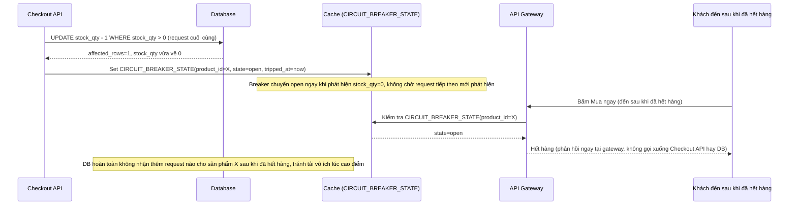

# Sequence - Enhance: Circuit breaker chặn request khi đã hết hàng

Đây là flow **enhance hoàn toàn mới**, mô tả cơ chế circuit breaker/giảm tải khi tồn kho đã về 0. Khi request cuối cùng trừ tồn kho về 0 (hoặc thất bại vì `affected_rows=0`), hệ thống lập tức bật cờ "hết hàng" ở tầng cache/API gateway, mọi request đến sau bị chặn ngay tại đó, không để lọt xuống DB gây tải vô ích. Đáp ứng **yêu cầu 5** của đề bài.

