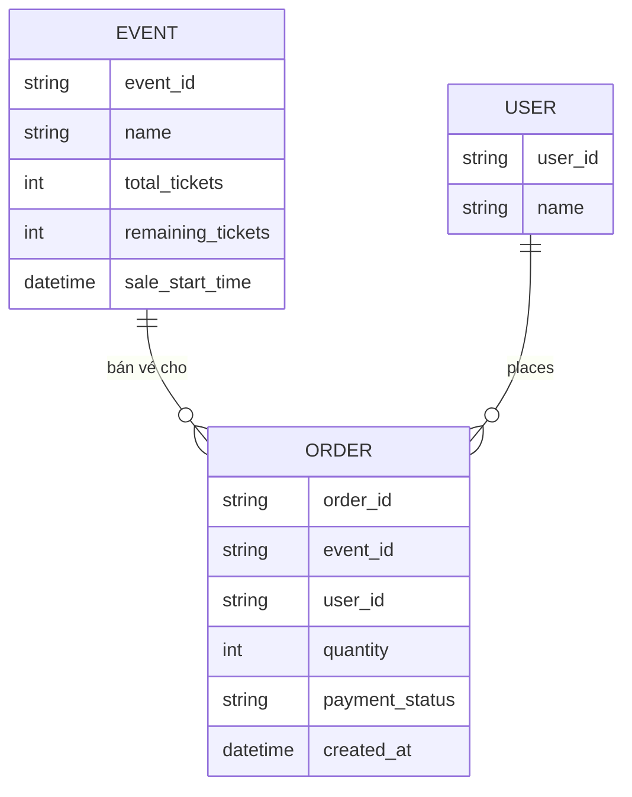

# ERD - Base: Bán vé theo số lượng, không có ghế cụ thể

Đây là trạng thái **base**, trước khi áp đề bài. Nền tảng bán vé sự kiện hiện đã có, nhưng khách chỉ chọn **số lượng vé** (giống flash sale sản phẩm thông thường), không chọn ghế cụ thể trên sơ đồ hội trường. Vé được xác nhận ngay sau khi thanh toán thành công, trừ trực tiếp vào số lượng còn lại — không có khái niệm "giữ chỗ tạm thời" (hold) vì không có 1 đơn vị ghế riêng lẻ nào cần khoá trước khi thanh toán. Đây là nền tảng để đề bài (chọn ghế cụ thể, giữ ghế tạm, hết hạn hold, giới hạn hold theo tài khoản, đổi ghế atomic, sơ đồ real-time) có ý nghĩa khi so sánh.

Lưu ý: không có entity `SEAT` đại diện cho từng ghế cụ thể với trạng thái `available/held/sold`, không có field nào lưu thời hạn giữ chỗ (`held_until`), và không có giới hạn số ghế được giữ đồng thời theo tài khoản — đây chính là các khoảng trống mà enhance sẽ lấp.
