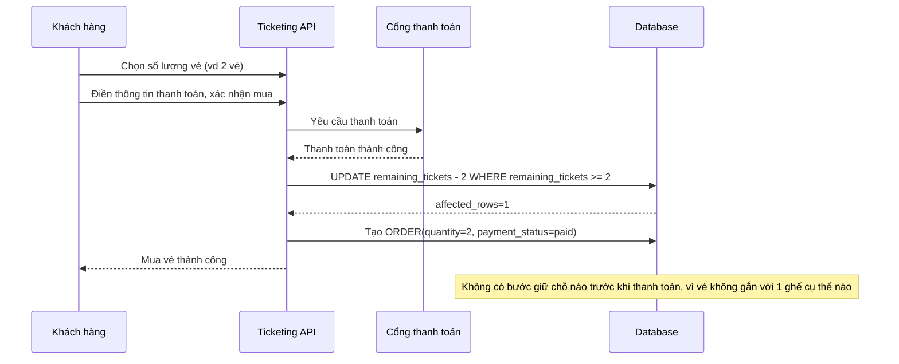

# Sequence - Base: Mua vé theo số lượng (không chọn ghế, không giữ chỗ)

Đây là flow **base**: khách chọn số lượng vé muốn mua, điền thông tin thanh toán và thanh toán ngay trong 1 luồng liên tục, vé chỉ được trừ vào `remaining_tickets` sau khi thanh toán thành công. Vì không có ghế cụ thể, không cần bước "giữ chỗ tạm thời" nào cả — đây chính là điểm khác biệt nền tảng mà đề bài sẽ thay đổi khi thêm chọn ghế cụ thể.

