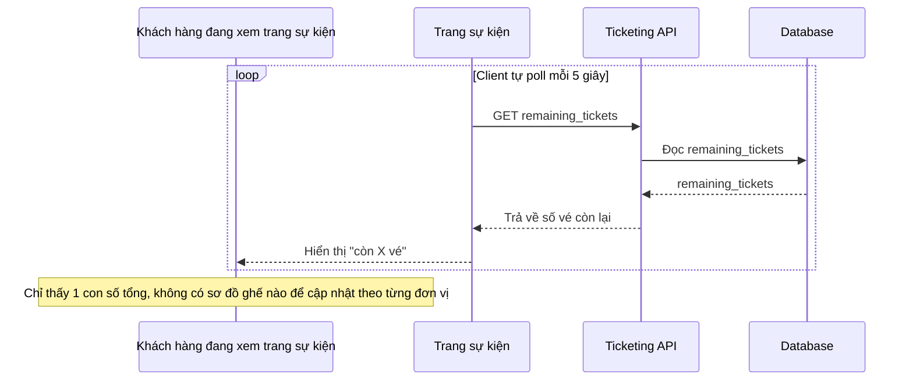

# Sequence - Base: Xem số vé còn lại (poll định kỳ, không real-time)

Đây là flow **base**: khách xem trang sự kiện, giao diện chỉ hiển thị 1 con số tổng "còn X vé", được client tự poll lại mỗi vài giây, không có cơ chế đẩy cập nhật real-time. Vì không có ghế cụ thể, không cần đồng bộ trạng thái từng ghế theo thời gian thực — đây là tiền đề cho yêu cầu 5 của đề bài, khi ghế cụ thể xuất hiện thì việc đồng bộ trạng thái từng ghế real-time trở nên cần thiết.

