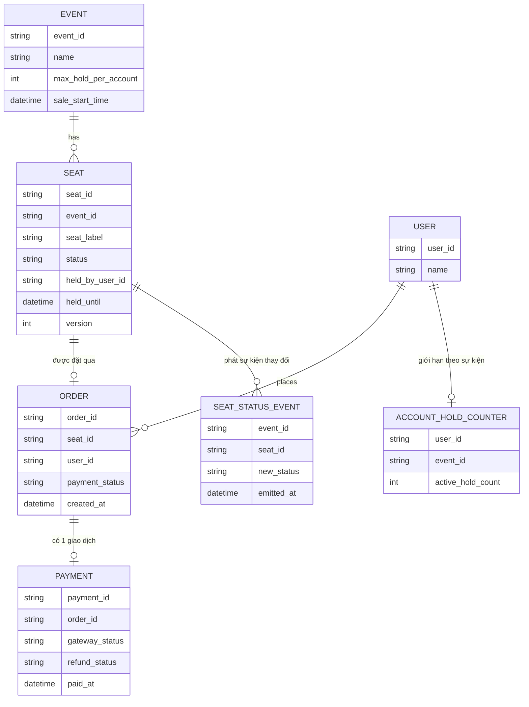

# ERD - Enhance: Ghế cụ thể với hold tạm thời, giới hạn theo tài khoản, real-time

Đây là trạng thái **enhance**, sau khi áp toàn bộ đề bài lên base. So với base, các thay đổi chính:

- Thêm entity `SEAT` đại diện cho từng ghế cụ thể trên sơ đồ, với `status` (`available`/`held`/`sold`), `held_by_user_id`, `held_until`, và `version` để chuyển trạng thái bằng update nguyên tử có điều kiện — đáp ứng **yêu cầu 1**.
- `SEAT.held_until` kết hợp với 1 job nền tự động nhả ghế hết hạn, và `ORDER`/`PAYMENT` có bước kiểm tra hold còn hiệu lực ngay trước khi chốt vé — đáp ứng **yêu cầu 2**.
- Thêm entity `ACCOUNT_HOLD_COUNTER` — đếm atomic số ghế đang giữ đồng thời theo `user_id` + `event_id`, so với `max_hold_per_account` — đáp ứng **yêu cầu 3**.
- Thao tác đổi ghế là 1 transaction gồm nhả `SEAT` cũ và giữ `SEAT` mới, không entity mới nhưng ràng buộc atomic xuyên 2 dòng `SEAT` — đáp ứng **yêu cầu 4**.
- `SEAT` phát sự kiện thay đổi trạng thái qua `SEAT_STATUS_EVENT` để mọi client xem cùng sự kiện nhận cập nhật gần real-time — đáp ứng **yêu cầu 5**.
- `PAYMENT` có thêm `refund_status` để xử lý trường hợp thanh toán ở cổng ngoài đã thành công nhưng hold đã hết hạn.

