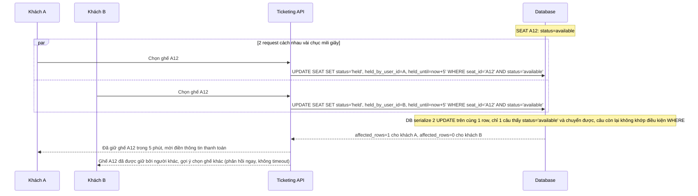

# Sequence - Enhance: Chọn ghế A12, giữ chỗ atomic

Đây là flow **enhance hoàn toàn mới**, minh hoạ đúng kịch bản nêu trong đề bài: 2 khách cùng bấm chọn ghế A12 gần như đồng thời (chênh nhau vài chục mili giây). Dùng update nguyên tử có điều kiện `UPDATE seats SET status='held' WHERE seat_id=? AND status='available'`, chỉ 1 request thành công; request thua nhận phản hồi ngay "ghế đã được giữ bởi người khác" và được gợi ý chọn ghế khác, không phải chờ timeout. Đáp ứng **yêu cầu 1** của đề bài.

