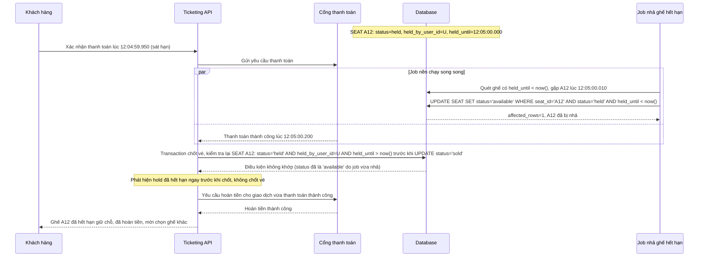

# Sequence - Enhance: Xác nhận thanh toán sát thời điểm hold hết hạn

Đây là flow **enhance hoàn toàn mới**, mô tả race giữa job tự động nhả ghế hết hạn và request xác nhận thanh toán đến ngay sát thời điểm hết hạn. Transaction xác nhận thanh toán phải kiểm tra hold vẫn còn hiệu lực (`held_by_user_id` khớp và chưa quá `held_until`) ngay trước khi chốt vé; nếu đã hết hạn phải từ chối rõ ràng và tự động hoàn tiền nếu cổng thanh toán bên ngoài đã báo thành công trước khi hệ thống kịp phát hiện hết hạn. Đáp ứng **yêu cầu 2** của đề bài.

