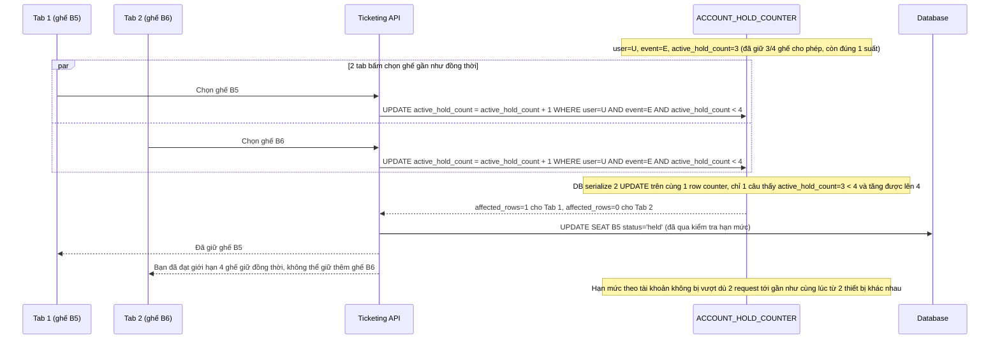

# Sequence - Enhance: Giới hạn số ghế giữ đồng thời theo tài khoản (atomic)

Đây là flow **enhance hoàn toàn mới**, mô tả trường hợp khách mở nhiều tab/thiết bị bằng cùng 1 tài khoản để chọn nhiều ghế khác nhau cho cùng sự kiện gần như đồng thời. Mỗi tài khoản chỉ được giữ tối đa `max_hold_per_account` ghế cùng lúc (vd 4 ghế), việc kiểm tra và tăng `active_hold_count` phải atomic để không bị vượt hạn mức khi nhiều request giữ ghế gửi lên gần như đồng thời từ cùng tài khoản. Đáp ứng **yêu cầu 3** của đề bài.

