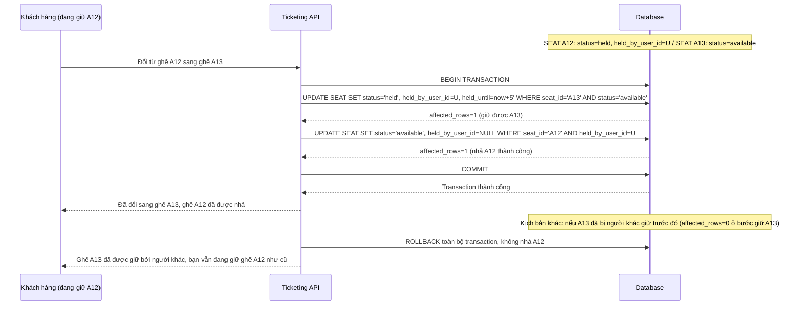

# Sequence - Enhance: Đổi ghế đã giữ sang ghế khác (transaction atomic)

Đây là flow **enhance hoàn toàn mới**, mô tả khách đã giữ ghế A12 nhưng đổi ý muốn chuyển sang ghế A13. Thao tác nhả ghế cũ và giữ ghế mới phải nằm trong 1 transaction atomic — không được để khoảng hở giữa 2 bước khiến ghế mới bị người khác cướp mất ngay sau khi ghế cũ vừa nhả, và nếu bước giữ ghế mới thất bại thì toàn bộ transaction rollback, ghế cũ vẫn được giữ nguyên chứ không bị nhả oan. Đáp ứng **yêu cầu 4** của đề bài.

