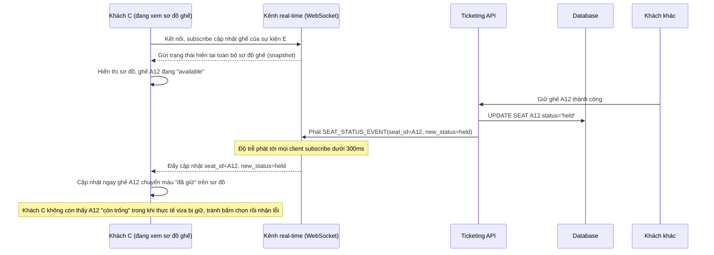

# Sequence - Enhance: Sơ đồ ghế cập nhật real-time cho mọi khách đang xem

Đây là flow **enhance** của `view-ticket-availability` (so với base). Khác biệt so với base: thay vì client tự poll 1 con số tổng mỗi vài giây, mỗi thay đổi trạng thái ghế (`available`/`held`/`sold`) được phát ngay qua kênh real-time (WebSocket/SSE) tới mọi client đang xem sơ đồ ghế của cùng sự kiện, với độ trễ chấp nhận được (vd dưới 300ms), tránh hiển thị 1 ghế "còn trống" trong khi thực tế vừa bị giữ vài trăm mili giây trước. Đáp ứng **yêu cầu 5** của đề bài.

