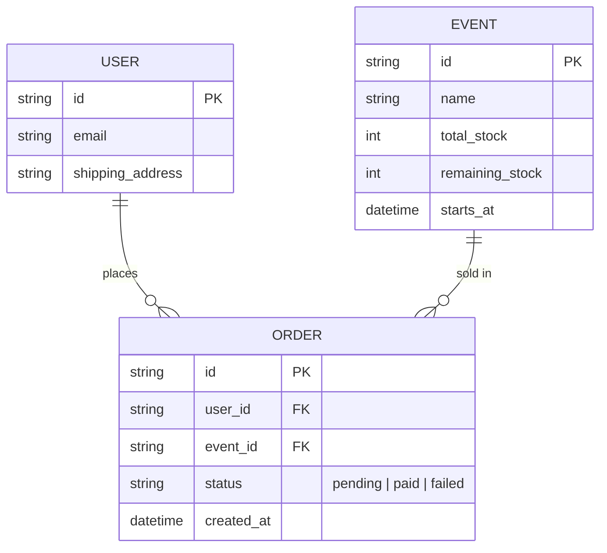

# Base ERD — Flash sale sneaker trước khi có cơ chế chống bot

Đây là **base**: mô hình dữ liệu suy luận từ ngữ cảnh đề bài, thể hiện trạng thái hệ thống **trước khi** áp các cơ chế chống bot/chống race. Đề bài nói tới việc bán 500 cặp giày vào giờ cố định — nên base chỉ cần đủ: sự kiện mở bán (EVENT), người dùng (USER), đơn hàng (ORDER) tham chiếu tới cả hai. Chưa có ràng buộc unique (event_id, user_id), chưa có idempotency key, chưa có challenge/captcha, chưa có cơ chế hàng đợi hay log rate limit — tất cả những thứ đó là phần enhance.

