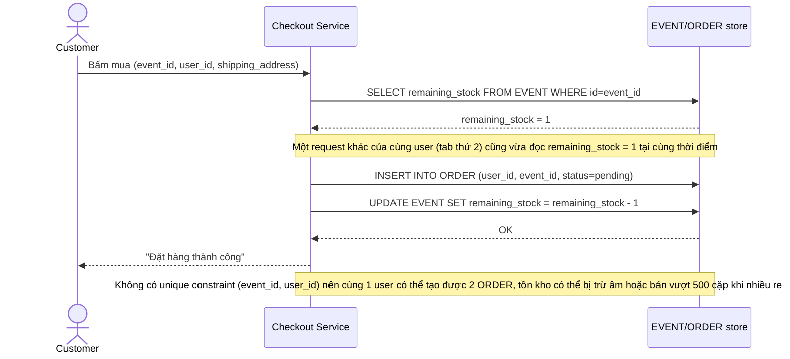

# Base sequence — Purchase sneaker (mua trực tiếp, không chống race, không chống bot)

Đây là **base**, flow "Mua giày lúc mở bán" ở trạng thái hiện tại — kiểm tra tồn kho rồi trừ tồn kho bằng 2 bước riêng biệt (đọc rồi ghi), không có ràng buộc DB nào ngăn 1 user mua nhiều lần, không có captcha, không có idempotency key. Flow này liên quan mật thiết tới enhance vì cả 5 yêu cầu của đề bài đều là các lớp bảo vệ được thêm vào đúng flow này.

