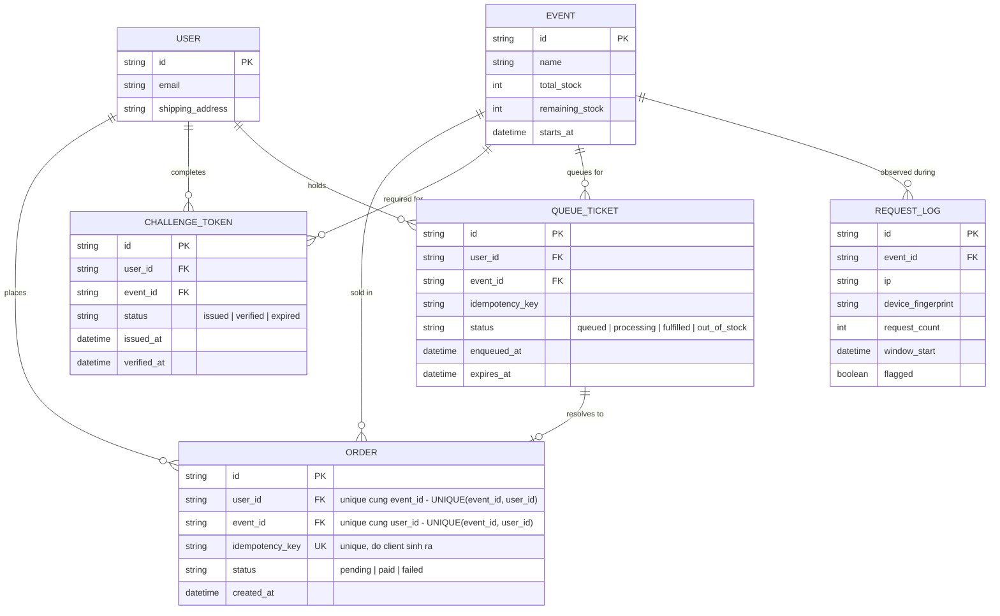

# Enhance ERD — Thêm challenge, hàng đợi, idempotency và log rate limit

Đây là **enhance**, mô hình dữ liệu sau khi áp toàn bộ đề bài lên base. So với base, các thay đổi:
- `ORDER` có thêm cột `idempotency_key` (unique) — đáp ứng yêu cầu 3 (chống xử lý trùng khi client tự retry), và có **ràng buộc unique tổng hợp (event_id, user_id)** ghi rõ trong ghi chú entity — đáp ứng yêu cầu 1 (chặn 1 user mua 2 lần ở tầng DB).
- Entity mới `CHALLENGE_TOKEN` — đại diện captcha/challenge phải vượt qua trước khi vào hàng đợi mua — đáp ứng yêu cầu 2 (lớp chống bot độc lập với transaction trừ tồn kho).
- Entity mới `QUEUE_TICKET` — đại diện vé xếp hàng chờ xử lý mua, có trạng thái và thời điểm hết hạn chờ — đáp ứng yêu cầu 4 (trả "hết hàng" trong khoảng thời gian giới hạn thay vì chờ vô thời hạn).
- Entity mới `REQUEST_LOG` — ghi nhận số request theo IP/device fingerprint theo cửa sổ thời gian, có cờ `flagged` để đánh dấu bất thường mà không chặn cứng — đáp ứng yêu cầu 5.

