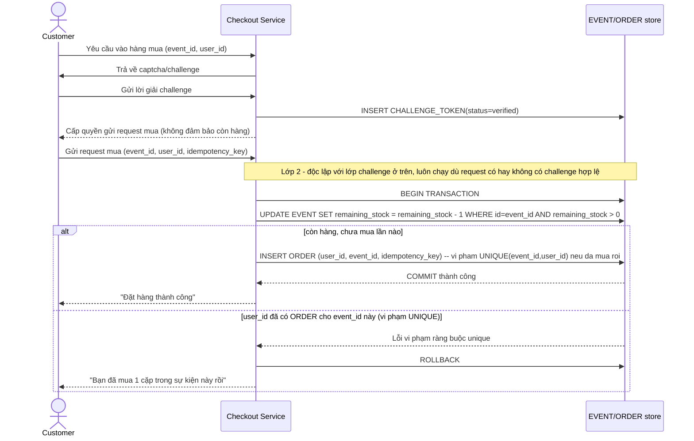

# Enhance sequence — Purchase sneaker (challenge trước hàng đợi, transaction atomic độc lập)

Đây là **enhance** của flow `purchase-sneaker` đã có ở base, đáp ứng **yêu cầu 1 và 2** của đề bài. So với base: (1) trước khi vào hàng đợi mua, request phải vượt qua `CHALLENGE_TOKEN` (captcha), (2) việc trừ tồn kho và tạo đơn hàng nay là 1 transaction DB atomic dùng ràng buộc `UNIQUE(event_id, user_id)` cộng điều kiện `WHERE remaining_stock > 0`, độc lập hoàn toàn với lớp challenge — tức là kể cả nếu challenge bị bot vượt qua được, transaction vẫn tự bảo vệ đúng đắn tồn kho và không cho mua trùng.

