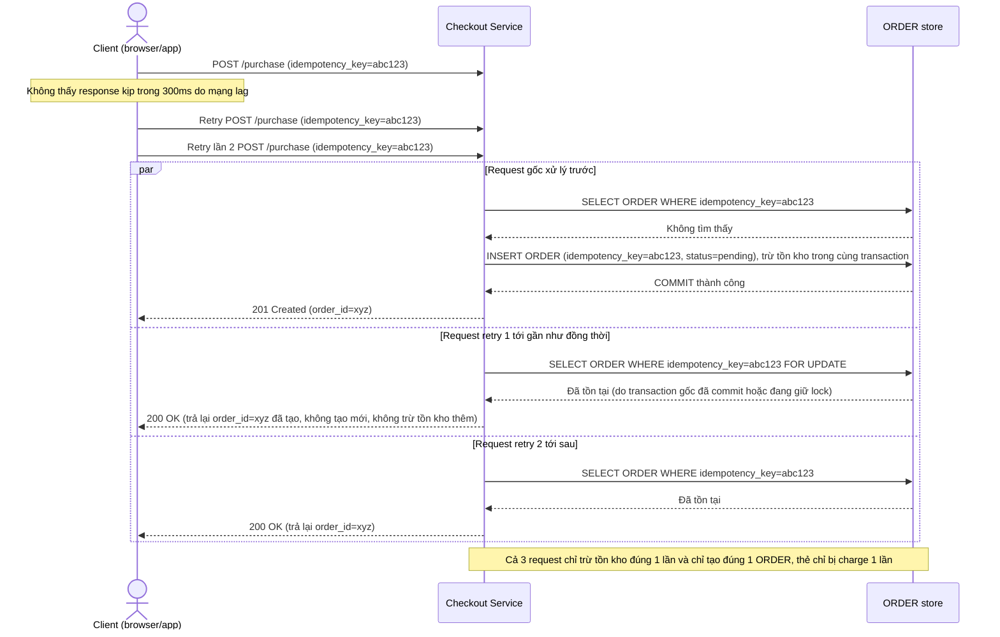

# Enhance sequence — Client retry do mạng lag, chống xử lý trùng bằng idempotency key

Đây là flow **enhance** hoàn toàn mới so với base, đáp ứng **yêu cầu 3** của đề bài: mô tả cụ thể trường hợp 1 user đã vượt challenge, gửi đúng 1 request mua, nhưng do mạng lag client tự động retry gửi thêm 2 request giống hệt trong vòng 1 giây. Hệ thống phải nhận diện cả 3 request mang cùng `idempotency_key` và chỉ xử lý 1 lần duy nhất.

