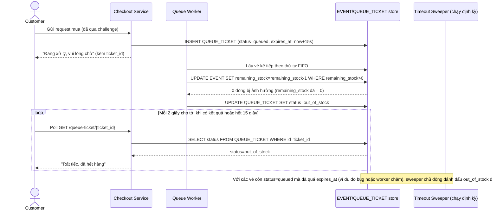

# Enhance sequence — Hàng đợi hết hàng, trả kết quả trong thời gian giới hạn

Đây là flow **enhance** hoàn toàn mới so với base, đáp ứng **yêu cầu 4** của đề bài: khi tồn kho giảm về 0, mọi request đang chờ trong `QUEUE_TICKET` phải được trả kết quả "hết hàng" trong một khoảng thời gian giới hạn rõ ràng, không để user chờ vô thời hạn.

