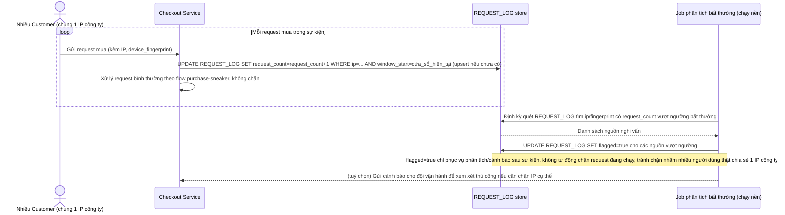

# Enhance sequence — Theo dõi rate limit theo IP/device fingerprint (log, không chặn cứng)

Đây là flow **enhance** hoàn toàn mới so với base, đáp ứng **yêu cầu 5** của đề bài: ghi log số request theo IP/device fingerprint để phát hiện nguồn bất thường trong sự kiện, nhưng không chặn cứng ngay lập tức để tránh ảnh hưởng người dùng thật dùng chung IP (mạng công ty/wifi công cộng).

