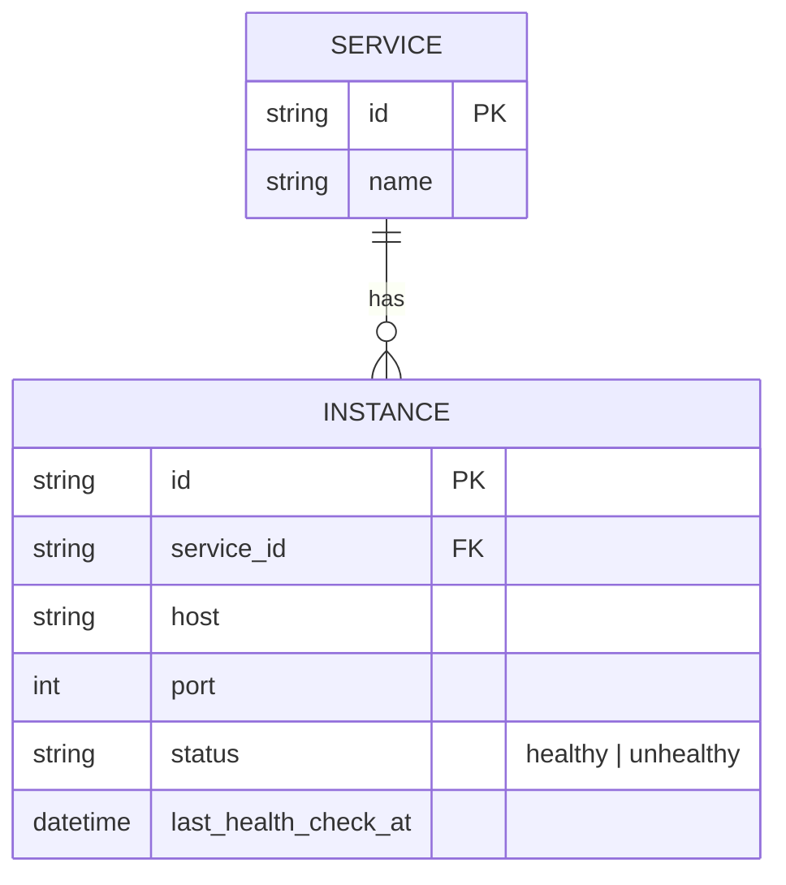

# Base ERD — API Gateway trước khi phối hợp graceful shutdown với backend

Đây là **base**: mô hình dữ liệu suy luận từ ngữ cảnh đề bài, thể hiện trạng thái hệ thống **trước khi** gateway biết phối hợp connection draining với từng service. Đề bài nói gateway đứng trước nhiều microservice, route request dựa trên trạng thái instance — nên base chỉ cần đủ: các service, các instance của từng service, và trạng thái healthy/unhealthy được cập nhật qua health check định kỳ. Chưa có tín hiệu shutdown chủ động, chưa có theo dõi kết nối keep-alive theo instance, chưa có circuit breaker điều chỉnh động, chưa có khái niệm rolling restart run — tất cả những thứ đó là phần enhance.

