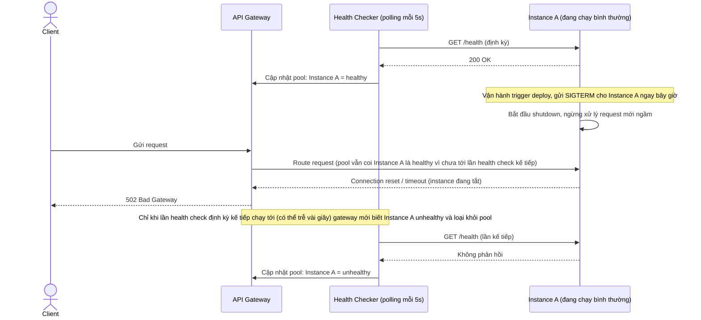

# Base sequence — Route request (chỉ dựa vào health check định kỳ)

Đây là **base**, flow "Gateway route request tới instance" ở trạng thái hiện tại — pool instance chỉ được cập nhật qua health check polling định kỳ (ví dụ mỗi 5 giây), gateway không có cách nào biết instance sắp tắt trước khi health check tự phát hiện. Flow này liên quan mật thiết tới enhance vì toàn bộ 5 yêu cầu của đề bài đều nhằm rút ngắn/loại bỏ khoảng trễ phát hiện này và các hệ quả của nó.

