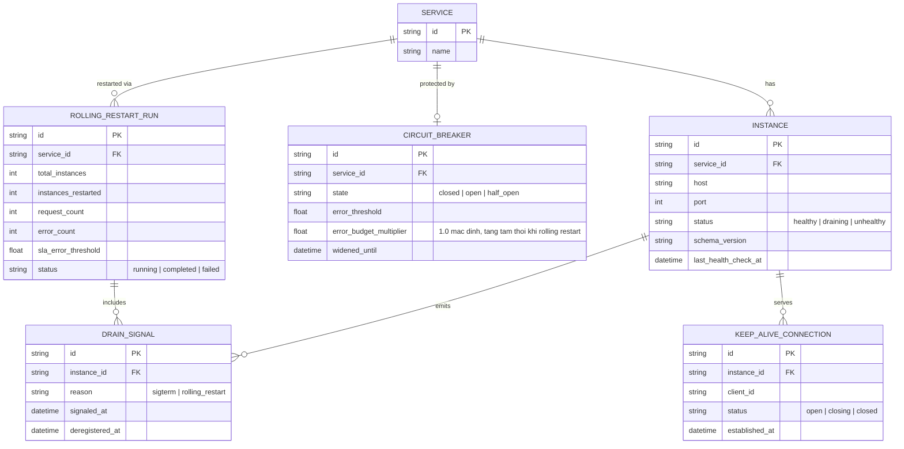

# Enhance ERD — Thêm tín hiệu drain, theo dõi connection, circuit breaker động, rolling restart run

Đây là **enhance**, mô hình dữ liệu sau khi áp toàn bộ đề bài lên base. So với base, các thay đổi:
- `INSTANCE` có thêm trạng thái `draining` và cột `schema_version` — đáp ứng yêu cầu 1 (tín hiệu shutdown chủ động) và yêu cầu 3 (nhận biết version khác nhau giữa các instance khi rolling restart đang chạy dở).
- Entity mới `DRAIN_SIGNAL` — sự kiện instance chủ động báo "sắp shutdown" gửi tới gateway trước khi ngừng nhận connection, độc lập với health check polling — đáp ứng yêu cầu 1.
- Entity mới `KEEP_ALIVE_CONNECTION` — theo dõi từng kết nối keep-alive đang mở gắn với instance nào, để gateway biết kết nối nào cần bị đóng/không tái sử dụng khi instance đó drain — đáp ứng yêu cầu 2.
- Entity mới `CIRCUIT_BREAKER` gắn theo service, có `error_budget_multiplier` được nới rộng tạm thời trong lúc rolling restart — đáp ứng yêu cầu 4.
- Entity mới `ROLLING_RESTART_RUN` — ghi nhận 1 lần rolling restart của 1 service (đang restart instance nào, đã xong bao nhiêu, số request/lỗi quan sát được) — làm nền cho bài test toàn trình đo tỷ lệ lỗi — đáp ứng yêu cầu 5.

