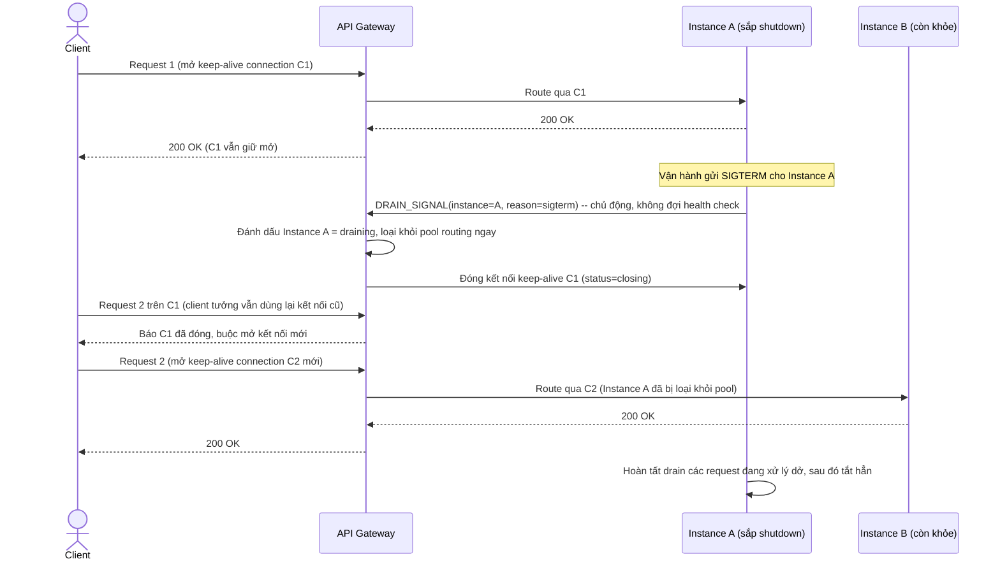

# Enhance sequence — Route request (drain signal chủ động, không tái dùng keep-alive cũ)

Đây là **enhance** của flow `route-request` đã có ở base, đáp ứng **yêu cầu 1 và 2** của đề bài. So với base: instance chủ động gửi `DRAIN_SIGNAL` cho gateway ngay khi nhận SIGTERM (không đợi health check polling phát hiện), gateway loại instance khỏi pool routing ngay lập tức. Với các kết nối HTTP keep-alive đang mở tới instance đó, gateway đóng kết nối (hoặc đánh dấu closing) để request tiếp theo trên client bắt buộc mở kết nối mới tới instance khác, không bao giờ tái sử dụng kết nối cũ tới instance đang chết.

