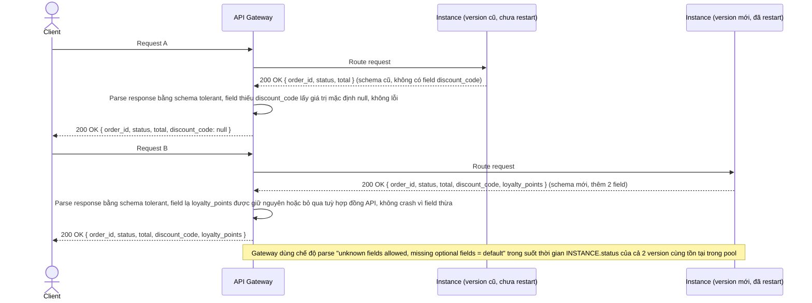

# Enhance sequence — Chịu đựng schema khác nhau giữa version cũ và mới khi rolling restart dở dang

Đây là flow **enhance** hoàn toàn mới so với base, đáp ứng **yêu cầu 3** của đề bài: trong lúc rolling restart, một phần instance đã lên version mới (schema response có thêm/bớt field), phần còn lại vẫn version cũ — gateway và client không được crash vì sự khác biệt này.

