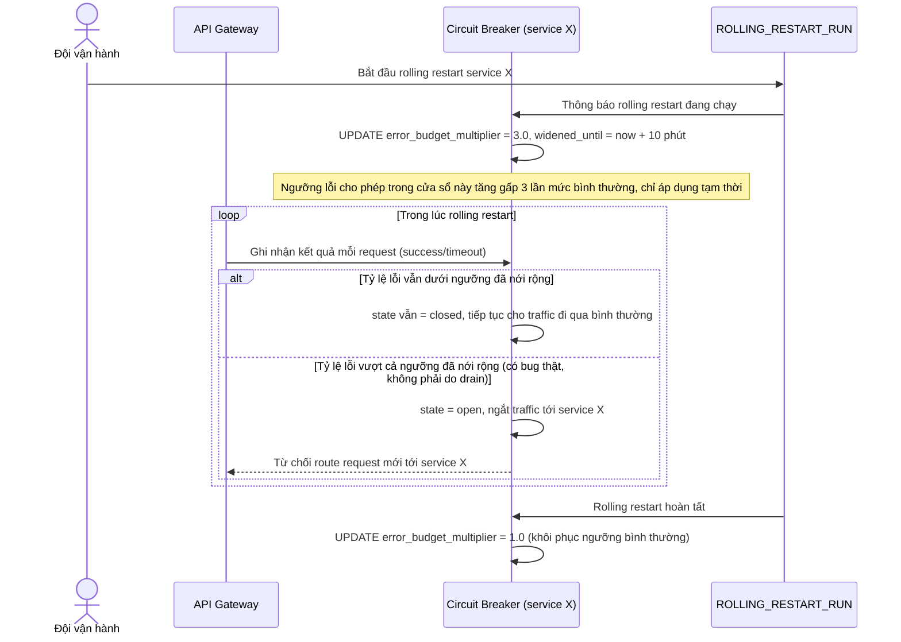

# Enhance sequence — Nới error budget circuit breaker tạm thời trong lúc rolling restart

Đây là flow **enhance** hoàn toàn mới so với base, đáp ứng **yêu cầu 4** của đề bài: khi rolling restart đang diễn ra, một vài request timeout do đúng lúc instance đang drain là chuyện bình thường và có thể dự đoán trước — circuit breaker phải tạm nới ngưỡng chịu lỗi trong cửa sổ thời gian đó, tránh ngắt toàn bộ traffic của service chỉ vì vài lỗi tạm thời.

