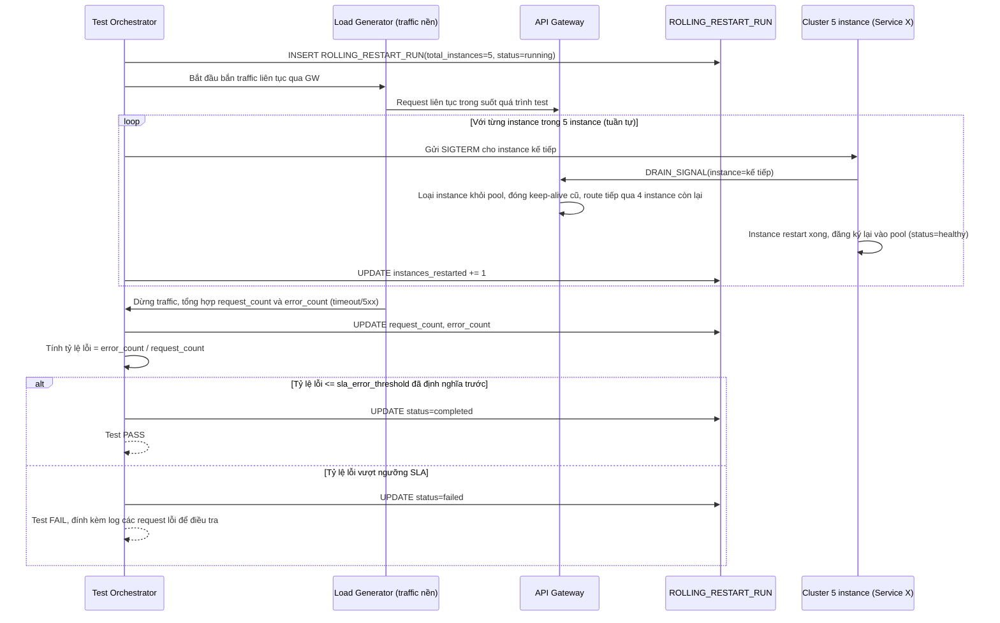

# Enhance sequence — Test toàn trình rolling restart 5 instance dưới traffic liên tục

Đây là flow **enhance** hoàn toàn mới so với base, đáp ứng **yêu cầu 5** của đề bài: kịch bản test tự động rolling restart lần lượt 5 instance của một service trong lúc có traffic liên tục chạy nền, đo tỷ lệ lỗi/timeout toàn bộ quá trình và so sánh với ngưỡng SLA đã định nghĩa trước.

